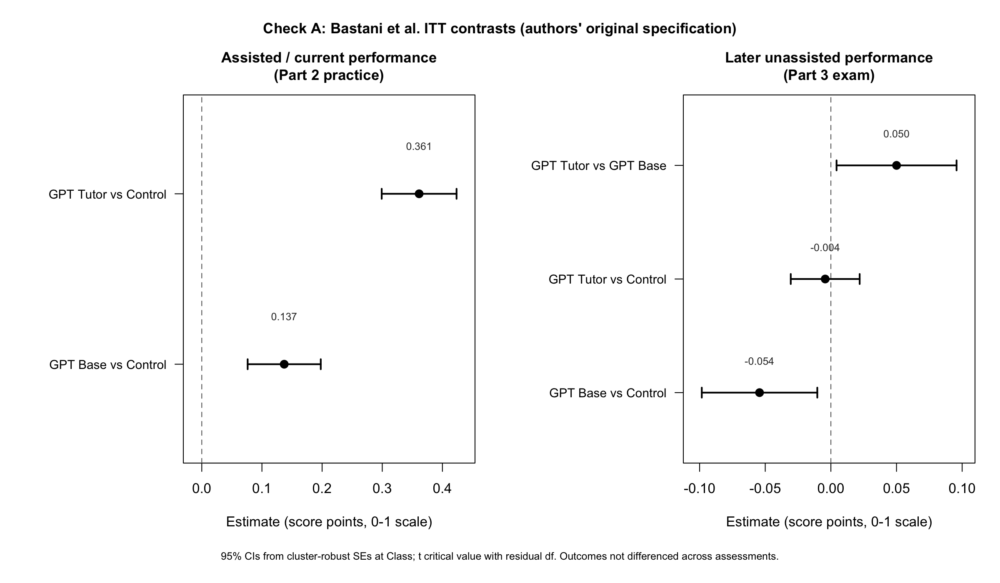

# Check A — Bastani et al. (2025)

Qualitative constraint check against Bastani, Bastani, Sungu, Ge, Kabakcı, and Mariman, *Generative AI without guardrails can harm learning*, PNAS 2025.

Proxies only (not exact M2 workflows): Control ≈ H, GPT Base ≈ L/D, GPT Tutor ≈ A/W. We do not estimate numerical attractors.

## Outcomes

| Outcome | Contrast | Estimate | SE | p | N |
| --- | --- | ---: | ---: | ---: | ---: |
| Assisted (Part 2) | GPT Base vs Control | 0.137 | 0.031 | 1.0×10⁻⁵ | 2848 |
| Assisted (Part 2) | GPT Tutor vs Control | 0.361 | 0.032 | <10⁻²⁸ | 2848 |
| Later unassisted (Part 3) | GPT Base vs Control | −0.054 | 0.022 | 0.015 | 2848 |
| Later unassisted (Part 3) | GPT Tutor vs Control | −0.004 | 0.013 | 0.75 | 2848 |
| Later unassisted (Part 3) | GPT Tutor vs GPT Base | 0.050 | 0.023 | 0.032 | 2848 |

Headline Table 1 coefficients reproduce. The later unassisted Tutor vs Base contrast supports the qualitative ordering \(m_A^c > m_L^c\). Tutor is not better than Control on the exam, so this does not support \(m_A^c > m_H^c\).

## Files

- [`checkA_results.csv`](checkA_results.csv) — five Check A contrasts
- [`checkA_coefficient_plot.png`](checkA_coefficient_plot.png)
- [`reproduction_log.csv`](reproduction_log.csv) — match to PNAS Table 1
- [`reproduction_notes.md`](reproduction_notes.md)
- [`extract_checkA.R`](extract_checkA.R) — same ITT specification as the authors
- [`authors/main_analysis.R`](authors/main_analysis.R) and [`authors/final_data.csv`](authors/final_data.csv) — unmodified headline script and student-level data from the authors’ package

Omitted: the 16 MB zip, `text_analysis/`, `additional_results/`, and problem-level files (not used for Check A). Original package: [obastani/GenAICanHarmLearning](https://github.com/obastani/GenAICanHarmLearning).
