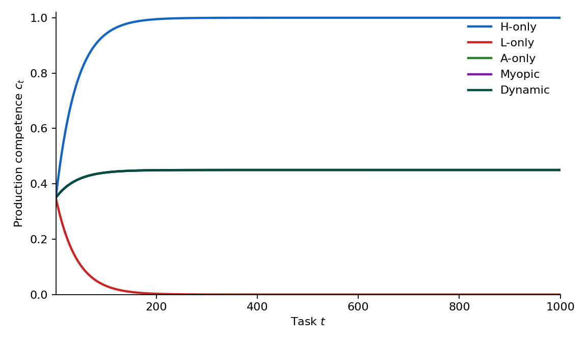
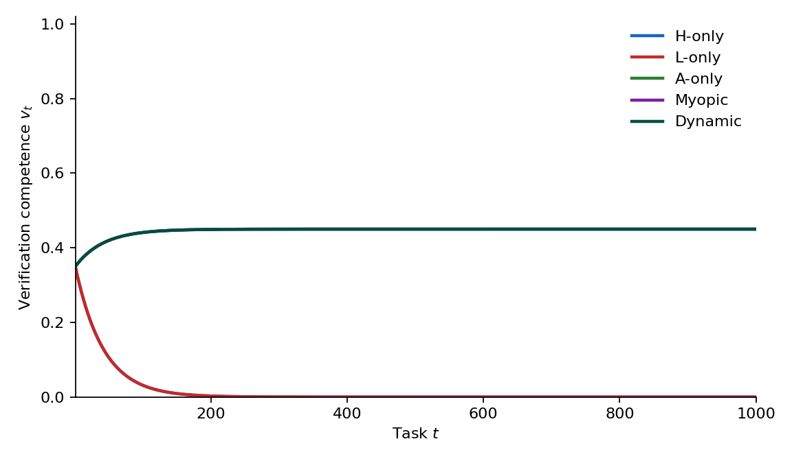
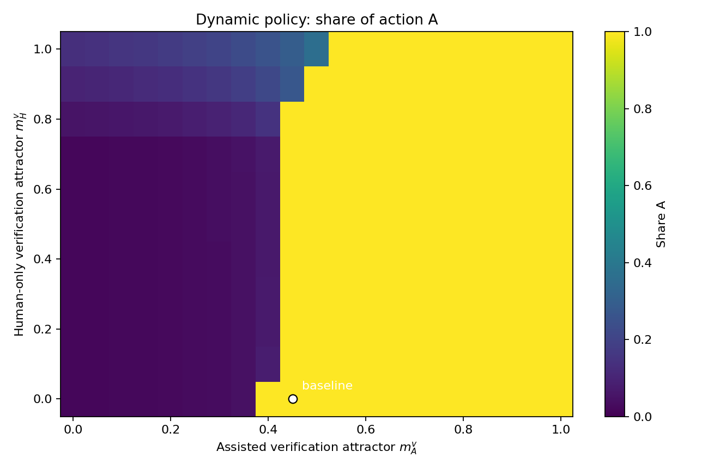
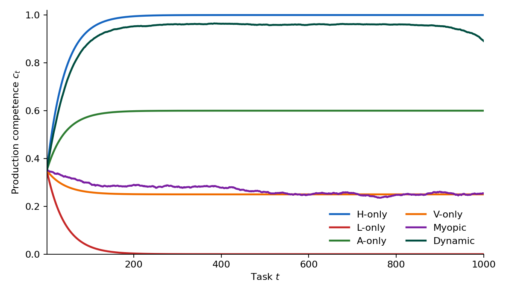
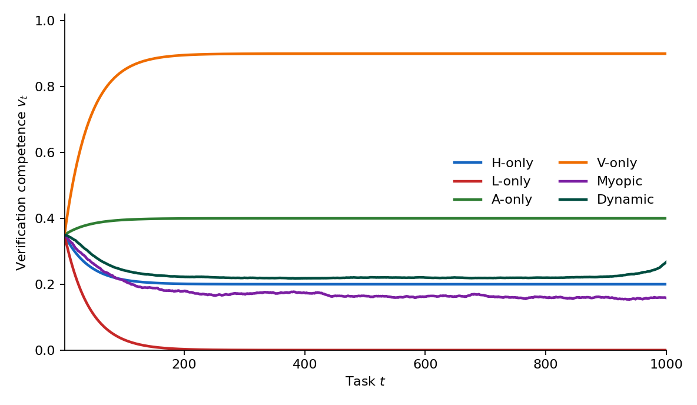
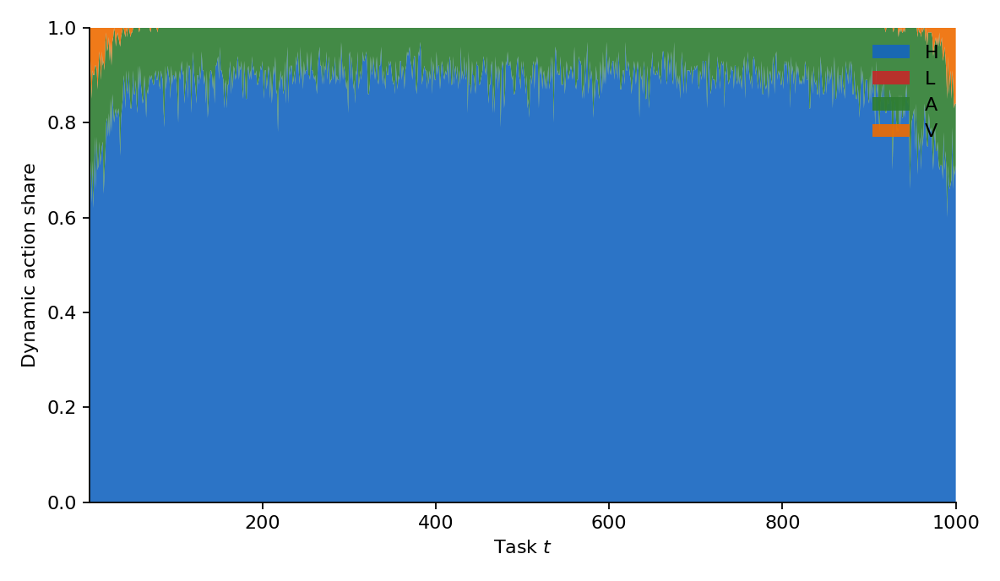
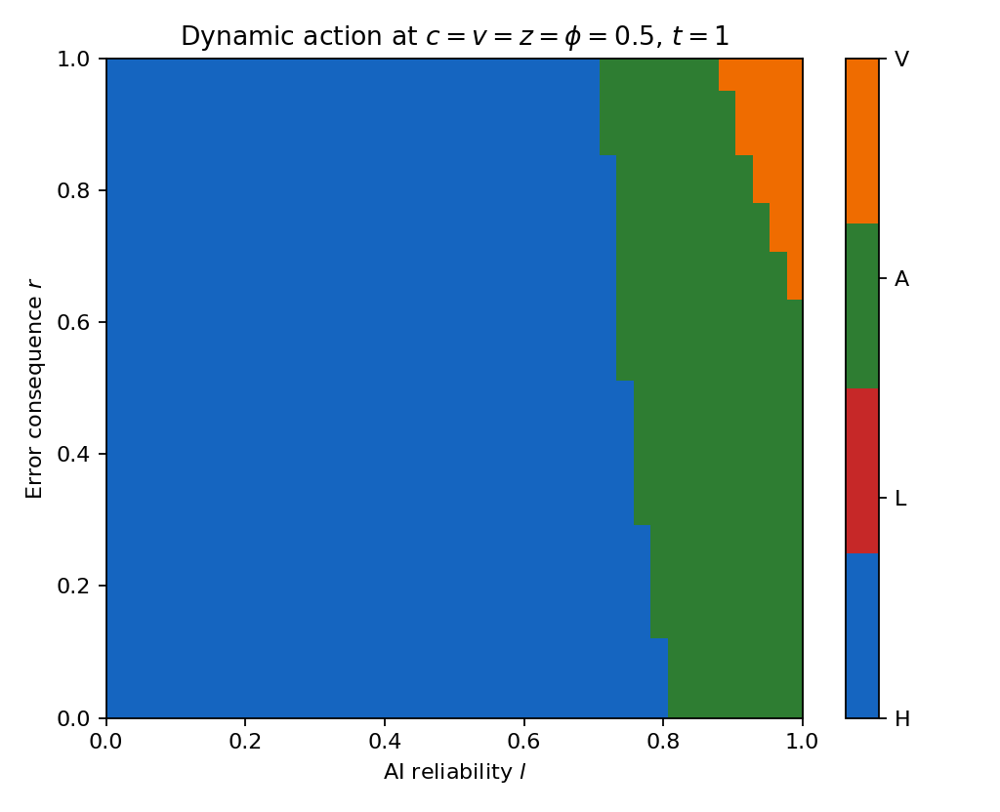

# Competence-aware AI work allocation

Finite-horizon models of how work is allocated across human, AI, and hybrid workflows when **competence evolves** with use. Each model is a self-contained Python folder: equations, parameters, runner, summary outcomes, and figures.

| Model | State | Workflows | What it adds |
| --- | --- | --- | --- |
| **M0** | production competence \(c_t\) | H, L, A | baseline |
| **M1** | production \(c_t\) and verification \(v_t\) | H, L, A | splits competence |
| **M2** | \(c_t, v_t\) | H, L, A, V | four organizational workflows |

Horizon \(T=1000\), \(N=100\) runs, master seed 42. Attractors and some M1/M2 parameters are modeling assumptions, not empirical estimates.

Python 3.9+ with `numpy` (and `matplotlib` to regenerate figures). From each model folder: `python run_m*.py`.

Raw per-period trajectory CSVs are omitted (tens to hundreds of MB). Policy-level summaries are in `outputs/`.

---

## M0 — one competence, three actions

Independent work (H), answer-oriented AI (L), and assisted co-production (A).

- Model: [`M0/m0.py`](M0/m0.py), [`M0/m0_config.py`](M0/m0_config.py)
- Formulas: [`M0/M0_formulas.tex`](M0/M0_formulas.tex)
- Outcomes: [`M0/outputs/m0_summary.json`](M0/outputs/m0_summary.json)

Baseline (`c_T`, cumulative payoff, action shares):

| Policy | Mean \(c_T\) | Mean \(\sum u\) | Share H | L | A |
| --- | ---: | ---: | ---: | ---: | ---: |
| H-only | 1.00 | 633 | 1.00 | 0 | 0 |
| L-only | 0.00 | 588 | 0 | 1.00 | 0 |
| A-only / Myopic | 0.45 | 645 | 0 | 0 | 1.00 |
| Dynamic | 0.86 | 649 | 0.71 | 0 | 0.29 |

---

## M1 — production and verification

Same three actions. Assisted quality uses verification competence: \(p_A = p_L + (1-p_L)\, v_t\, p_H\).

- Model: [`M1/m1.py`](M1/m1.py), [`M1/m1_config.py`](M1/m1_config.py)
- Outcomes: [`M1/outputs/m1_summary.json`](M1/outputs/m1_summary.json), attractor sensitivity in [`M1/outputs/m1_attractor_sensitivity.csv`](M1/outputs/m1_attractor_sensitivity.csv)
- Figures: [`M1/figures/`](M1/figures/)

At the baseline \((m_H^v, m_A^v) = (0, 0.45)\), Dynamic coincides with A-only. H-only still drives \(c\to 1\) and \(v\to 0\).

---

## M2 — four workflows

H (human-only), L (delegation), A (co-production), V (structured verification).

- Model: [`M2/m2.py`](M2/m2.py), [`M2/m2_config.py`](M2/m2_config.py)
- Outcomes: [`M2/outputs/m2_summary.json`](M2/outputs/m2_summary.json), [`M2/outputs/m2_sensitivity.csv`](M2/outputs/m2_sensitivity.csv), [`M2/outputs/m2_phi_v_test.csv`](M2/outputs/m2_phi_v_test.csv)
- Figures: [`M2/figures/`](M2/figures/)

Baseline Dynamic uses mostly H, some A, almost no V, and never L. Myopic uses L heavily. V is rare and concentrated at the beginning and end of the horizon.
